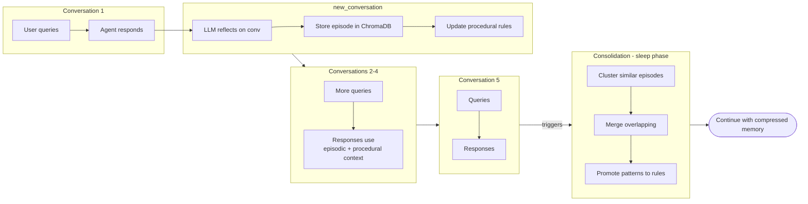

# Architecture

## A. High-Level Flow

User queries flow through the agent, which assembles context from all active memory systems into a single LLM call.

## B. Per-Query Pipeline

Each `agent.chat()` call assembles context from multiple memory systems and sends a single LLM request.

## C. Consolidation Pipeline

Triggered every N conversations during `new_conversation()`. Compresses episodic memory and extracts behavioral patterns.

## D. Component Reference

| Module | File | Purpose | Key Config |
|--------|------|---------|------------|
| **Working Memory** | `memory/working.py` | Chat history buffer, Anthropic API calls | `MODEL_NAME`, `MAX_TOKENS`, `TEMPERATURE` |
| **Semantic Memory** | `memory/semantic.py` | PDF ingestion, text chunking, ChromaDB vector search | `CHUNK_SIZE=800`, `CHUNK_OVERLAP=100`, `SEMANTIC_TOP_K=10` |
| **Episodic Memory** | `memory/episodic.py` | LLM reflection on conversations, recency-weighted recall | `EPISODIC_TOP_K=3`, `RECENCY_HALF_LIFE_HOURS=72` |
| **Procedural Memory** | `memory/procedural.py` | Incremental rule updates via LLM synthesis, persisted to JSON | `MAX_PROCEDURAL_RULES=15` |
| **Consolidation** | `memory/consolidation.py` | Clustering, merging, and pattern promotion | `CONSOLIDATION_THRESHOLD=0.70`, `CONSOLIDATION_EVERY_N=5`, `PROMOTION_MIN_OCCURRENCES=3` |
| **Agent** | `agent.py` | Orchestrator - builds system prompt, routes queries | `mode="full"` or `"semantic_only"` |
| **Config** | `config.py` | All constants and hyperparameters | - |

## E. Conversation Lifecycle

Shows what happens across a multi-conversation session.

