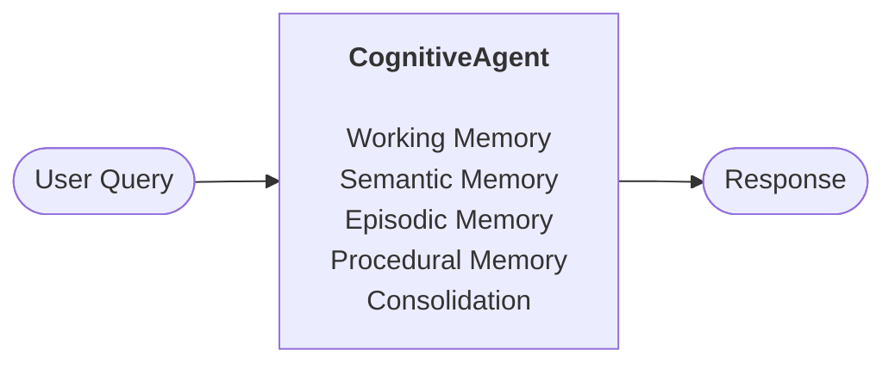

# Cognitive Memory Agent

A cognitive architecture for LLM-based chatbots that goes beyond vanilla RAG. Built on Anthropic's Claude, the agent maintains five distinct memory systems - working, semantic, episodic, procedural, and consolidation - that mirror how human cognition stores, retrieves, and refines knowledge over time. The result is an agent that remembers past conversations, learns from experience, and produces personalized responses tailored to each user's context, preferences, and history.

Documents are ingested into a ChromaDB vector store for semantic retrieval, conversations are reflected on and stored as episodic memories with recency-weighted recall, and a periodic "sleep" phase clusters similar episodes, compresses them, and promotes recurring patterns into persistent behavioral rules.

## Memory Systems



- **Working Memory** - Current conversation context (chat history buffer)
- **Semantic Memory** - RAG over documents via ChromaDB with cosine similarity search
- **Episodic Memory** - Past conversation storage with LLM-generated reflections and recency-weighted retrieval
- **Procedural Memory** - Self-updating behavioral rules that evolve incrementally with experience
- **Consolidation** - Periodic "sleep" phase that clusters similar episodes, merges them, and promotes recurring patterns to procedural rules

See [ARCHITECTURE.md](ARCHITECTURE.md) for detailed diagrams of how the systems interact.

## Setup

```bash
# Create conda environment
conda create -n cognitive-memory python=3.11 -y
conda activate cognitive-memory

# Install dependencies
pip install -r requirements.txt

# Set your API key (pick one)
echo ANTHROPIC_API_KEY=your-key > .env   # recommended
export ANTHROPIC_API_KEY="your-key"       # or export directly

# Run the interactive CLI
python demo.py
```

## Usage

### Interactive CLI (`demo.py`)

Drop any PDF into the `data/` directory and the agent will ingest it on startup.

```
You: What temperature does the QA-7 operate at?
Agent: The QA-7 operates at exactly 22.4 degrees Celsius...

/new      - Start a new conversation (saves episodic memory)
/ingest   - Reload documents from data/
/sleep    - Manually trigger memory consolidation
/quit     - Save and exit
```

### Benchmark Notebook (`demo_full.ipynb`)

Runs a structured comparison between the full agent and a baseline (semantic-only RAG). Tests semantic retrieval, episodic recall, consolidation, and post-consolidation synthesis across 18 questions on a synthetic PDF.

The baseline can be instantiated with `CognitiveAgent(mode="semantic_only")` - it uses only working + semantic memory, providing a vanilla RAG reference point.

### Smoke Test (`scripts/test_smoke.py`)

Quick end-to-end test that exercises all 5 memory systems in sequence.

```bash
python scripts/test_smoke.py
```

## Project Structure

```
agent.py                  # Orchestrator - builds system prompt from all memory sources
memory/
  working.py              # Chat history buffer + Anthropic API calls
  semantic.py             # PDF ingestion, chunking, ChromaDB vector retrieval
  episodic.py             # Conversation reflection, storage, recency-weighted recall
  procedural.py           # Incremental rule updates via LLM synthesis
  consolidation.py        # Clustering, merging, and pattern promotion
config.py                 # All constants and hyperparameters
demo.py                   # Interactive CLI chat interface
demo_full.ipynb           # Benchmark notebook (baseline vs full agent)
scripts/
  generate_pdf.py         # Generates the synthetic Zeltron Corporation PDF
  test_smoke.py           # End-to-end smoke test
figures/                  # Benchmark output charts (generated by notebook)
data/                     # PDF documents for semantic memory ingestion
```

## How Consolidation Works

Every N conversations (configurable), the agent runs a "sleep" cycle:

1. **Cluster** - Groups episodic memories by embedding cosine similarity
2. **Merge** - LLM synthesizes each cluster into one unified memory, deletes originals
3. **Promote** - Extracts recurring patterns across episodes and adds them as procedural rules

This prevents unbounded memory growth and improves retrieval quality over time.

## Limitations & Next Steps

**What the benchmark shows:**
- Semantic retrieval (RAG) works equally well for both agents on factual questions
- Episodic memory provides a clear advantage for cross-conversation recall
- Consolidation successfully compresses overlapping memories
- Post-consolidation synthesis enables cross-conversation theme extraction
- The full pipeline produces personalized responses using all 5 memory systems together

**What needs improvement:**
- Hallucination resistance varies between runs (LLM non-determinism)
- Consolidation threshold sensitivity - too strict means no merges, too loose means over-merging

**Next steps:**
- [ ] Retrieval gating - route queries to relevant memory types only
- [ ] Conflict detection between semantic and episodic memory
- [ ] MCP server integration - expose memory systems as tools for Claude
