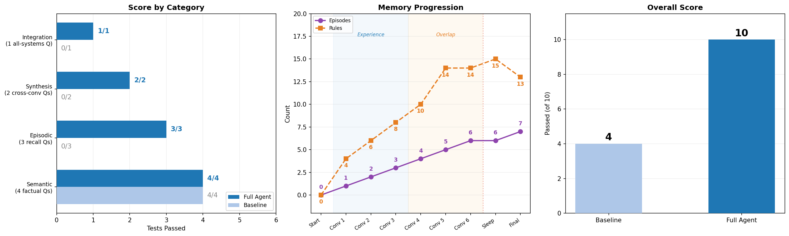

# Cognitive Memory Agent

A cognitive architecture for LLM-based chatbots that goes beyond vanilla RAG. Built on Anthropic's Claude, the agent maintains five distinct memory systems - working, semantic, episodic, procedural, and consolidation - that mirror how human cognition stores, retrieves, and refines knowledge over time. The result is an agent that remembers past conversations, learns from experience, and produces personalized responses tailored to each user's context, preferences, and history.

Documents are ingested into a ChromaDB vector store for semantic retrieval, conversations are reflected on and stored as episodic memories with recency-weighted recall, and a periodic "sleep" phase clusters similar episodes, compresses them, and promotes recurring patterns into persistent behavioral rules.

## Memory Systems


- **Working Memory** - Current conversation context (chat history buffer)
- **Semantic Memory** - RAG over documents via ChromaDB with cosine similarity search
- **Episodic Memory** - Past conversation storage with LLM-generated reflections and recency-weighted retrieval
- **Procedural Memory** - Self-updating behavioral rules that evolve incrementally with experience
- **Consolidation** - Periodic "sleep" phase that clusters similar episodes, merges them, and promotes recurring patterns to procedural rules

See [ARCHITECTURE.md](ARCHITECTURE.md) for detailed diagrams of how the systems interact.

## How Consolidation Works

Every N conversations (configurable), the agent runs a "sleep" cycle:

1. **Cluster** - Groups episodic memories by embedding cosine similarity
2. **Merge** - LLM synthesizes each cluster into one unified memory, deletes originals
3. **Promote** - Extracts recurring patterns across episodes and adds them as procedural rules

This prevents unbounded memory growth and improves retrieval quality over time.

## Results

Four focused notebooks benchmark each memory system individually and together:

| Notebook | What it tests |
|----------|--------------|
| [`01_semantic.ipynb`](notebooks/01_semantic.ipynb) | RAG retrieval over the Zeltron PDF - 12 questions at 3 difficulty levels |
| [`02_episodic.ipynb`](notebooks/02_episodic.ipynb) | Conversation memory, recall, retrieval gating, and recency weighting |
| [`03_consolidation.ipynb`](notebooks/03_consolidation.ipynb) | Sleep phase merging, procedural rule promotion, detail preservation |
| [`04_full_pipeline.ipynb`](notebooks/04_full_pipeline.ipynb) | End-to-end benchmark: full agent vs vanilla RAG across all systems |

The baseline can be instantiated with `CognitiveAgent(mode="semantic_only")` - it uses only working + semantic memory, providing a vanilla RAG reference point.



<details>
<summary><strong>Dashboard breakdown (click to expand)</strong></summary>

<br>

#### Score by Category (left)

Four test categories, Full Agent (dark) vs Baseline (light):

| Category | Full | Baseline | Why |
|----------|------|----------|-----|
| **Semantic** (4 factual Qs) | 4/4 | 4/4 | Parity - both use the same RAG pipeline, so pure document lookup is equal |
| **Episodic** (3 recall Qs) | 3/3 | 0/3 | User-specific details (budget, location, compliance) - baseline has zero conversation memory |
| **Synthesis** (2 cross-conv Qs) | 2/2 | 0/2 | Combining themes across multiple past conversations - impossible without episodic + consolidation |
| **Integration** (1 all-systems Q) | 1/1 | 0/1 | Passes only if the response includes memory-specific details ($50k, NATO, fintech) that can't come from the query text or PDF alone |

#### Memory Progression (middle)

Per-conversation tracking with two phase bands:

- **Experience** (blue band, Conv 1-3) - Three conversations planting distinct user context: budget/Uppsala, fintech preferences, NATO compliance. These are intentionally different so they survive consolidation intact.
- **Overlap** (orange band, Conv 4-6) - Three conversations deliberately covering the same subject (QA-7 technology) from different angles. This gives the consolidation sleep phase similar episodes to work with - if two are above the 0.70 cosine similarity threshold, they get merged.

Two lines track memory growth:

- **Episodes** (purple) grow linearly: one per conversation. Sleep may reduce the count when overlapping episodes merge. Final count increases by one more after the conflict detection conversation.
- **Rules** (orange) grow fast as the LLM synthesizes multiple rules per conversation, plateauing at `MAX_PROCEDURAL_RULES=15`. May drop slightly after Sleep - the procedural `update()` method consolidates redundant rules, naturally pruning the count.

The red dotted line marks where consolidation (Sleep) runs.

#### Overall Score (right)

Baseline **4/10** vs Full Agent **10/10**. The 6-point gap comes entirely from episodic recall (3), cross-conversation synthesis (2), and the integration test (1) - all categories that require memory beyond RAG.

</details>

## Setup

```bash
# Create conda environment
conda create -n cognitive-memory python=3.11 -y
conda activate cognitive-memory

# Install dependencies
pip install -r requirements.txt

# Set your API key (pick one)
echo ANTHROPIC_API_KEY=your-key > .env   # recommended
export ANTHROPIC_API_KEY="your-key"       # or export directly

# Run the interactive CLI
python demo.py
```

## Usage

### Interactive CLI (`demo.py`)

Drop any PDF into the `data/` directory and the agent will ingest it on startup.

```
You: What temperature does the QA-7 operate at?
Agent: The QA-7 operates at exactly 22.4 degrees Celsius...

/new      - Start a new conversation (saves episodic memory)
/ingest   - Reload documents from data/
/sleep    - Manually trigger memory consolidation
/quit     - Save and exit
```

### Smoke Test (`scripts/test_smoke.py`)

Quick end-to-end test that exercises all 5 memory systems in sequence.

```bash
python scripts/test_smoke.py
```

## Project Structure

```
agent.py                  # Orchestrator - builds system prompt from all memory sources
memory/
  working.py              # Chat history buffer + Anthropic API calls
  semantic.py             # PDF ingestion, chunking, ChromaDB vector retrieval
  episodic.py             # Conversation reflection, storage, recency-weighted recall
  procedural.py           # Incremental rule updates via LLM synthesis
  consolidation.py        # Clustering, merging, and pattern promotion
config.py                 # All constants and hyperparameters
demo.py                   # Interactive CLI chat interface
notebooks/
  01_semantic.ipynb       # Semantic retrieval benchmark
  02_episodic.ipynb       # Episodic memory benchmark
  03_consolidation.ipynb  # Consolidation & procedural memory benchmark
  04_full_pipeline.ipynb  # Full pipeline benchmark (all 5 systems)
scripts/
  generate_pdf.py         # Generates the synthetic Zeltron Corporation PDF
  test_smoke.py           # End-to-end smoke test
figures/                  # Benchmark output charts (generated by notebook)
data/                     # PDF documents for semantic memory ingestion
```

## Limitations & Next Steps

**What the benchmark shows:**
- Semantic retrieval (RAG) works equally well for both agents on factual questions (4/4 parity)
- Episodic memory provides a clear advantage for cross-conversation recall (3/3 vs 0/3)
- Post-consolidation synthesis enables cross-conversation theme extraction (2/2 vs 0/2)
- Integration test verifies the full agent recalls memory-specific details the baseline cannot (1/1 vs 0/1)
- Retrieval gating correctly routes personal queries to episodic memory and factual queries to semantic memory
- Conflict detection flags contradictions between semantic and episodic sources transparently

**What needs improvement:**
- Hallucination resistance varies between runs (LLM non-determinism)
- Consolidation threshold sensitivity - too strict means no merges, too loose means over-merging
- Episodic recall can miss details if the LLM reflection doesn't prominently feature them in the summary

**Next steps:**
- [ ] Markdown-first storage - episodes as .md files with YAML frontmatter, ChromaDB as a rebuildable search index
- [ ] Procedural rules as tool-compatible markdown (CLAUDE.md / .clinerules / .cursorrules format)
- [ ] Adapter layer - sync memory state to Claude Code, Cline, Cursor, and other tool formats
- [ ] MCP server - expose memory operations (store, recall, consolidate, rules) as tools for direct integration
